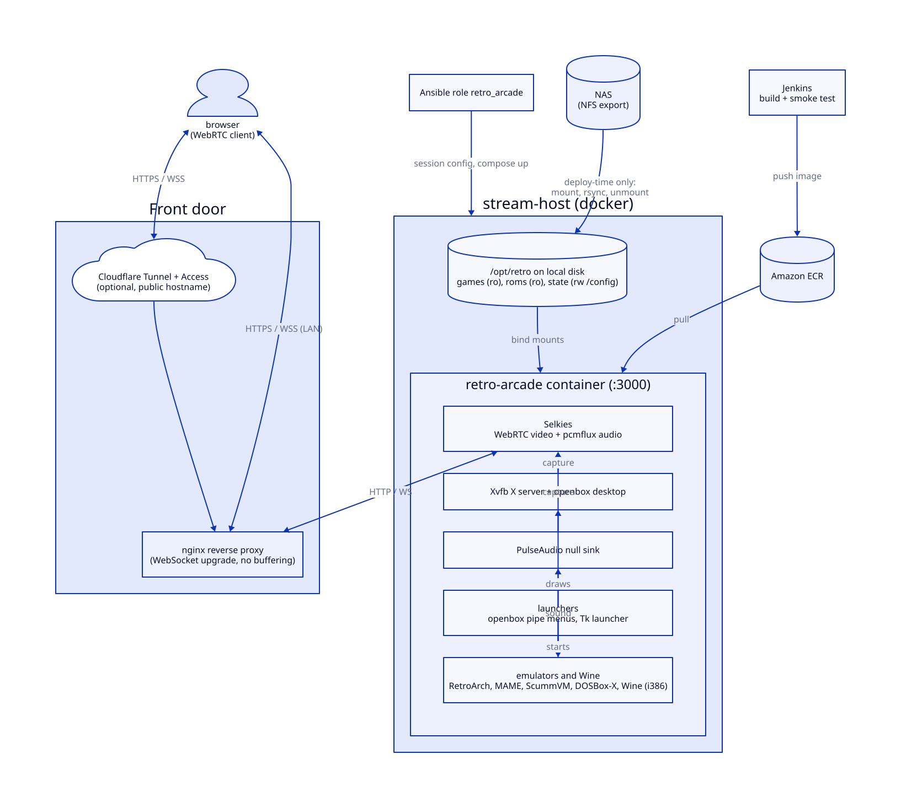

# selkies-retro-arcade

A containerized Linux desktop streamed to the browser over WebRTC with
[Selkies](https://github.com/selkies-project/selkies), with audio carried in the
same stream. The workload it was built for is retro gaming: emulator front-ends
(RetroArch/libretro, MAME, ScummVM, DOSBox-X) and 32-bit Windows applications
under Wine. Any X11 application would stream the same way.

This comes from a working homelab. Host names, addresses, registry IDs and
domains here are placeholders. **No game content is included or referenced.**
Bring your own legally obtained software and ROM dumps.

## Architecture



- **Image** (`image/`): LinuxServer `baseimage-selkies` (Ubuntu 24.04) plus Wine
  with i386 multiarch, 32-bit Mesa GL, RetroArch + three libretro cores, three
  libretro MAME cores for different MAME versions (2003-Plus, 2010, 2016; fetched
  from the libretro nightly buildbot at build time), standalone MAME, ScummVM, DOSBox-X and a
  set of launcher scripts.
- **CI** (`Jenkinsfile`): builds the image, runs a smoke test inside it
  (32-bit Wine present, 32-bit libGL present, cores present, menu generator
  emits valid XML), pushes to ECR.
- **Deploy** (`ansible/`): one role that syncs content from a NAS to local disk,
  renders session config into the persistent volume, logs in to ECR and runs the
  container with docker compose.
- **Launcher**: an openbox right-click menu (pipe menus generated on demand by
  `retro-menu`) and a full-screen Tk launcher with fuzzy search
  (`retro-launcher`). Both read the same plain-text curation lists
  (`favorites.list`, `working.list`, `hidden.list`, `collections/*.list`).

## Gotchas this encodes

These cost real debugging time and are the most reusable part of the repo:

- **RetroArch gets no keyboard input under Selkies unless `video_driver=sdl2`.**
  Under the GLX driver it renders fine but ignores every keypress, even though
  X delivers the events. `input_driver` must be `x`, not `udev`: the container's
  `/dev/input` holds only Selkies' virtual gamepads. See
  `image/root/etc/retroarch-drivers.cfg`. Standalone MAME is unaffected because
  it is already SDL-based.
- **32-bit Windows apps need `dpkg --add-architecture i386`, `wine32:i386`, and
  the i386 Mesa libraries.** Wine translates Direct3D to OpenGL, and the base
  image ships no GL at all, so without `libgl1:i386` a DirectX app cannot get a
  graphics context.
- **Old apps want display modes Xvfb does not advertise.** Launching inside a
  Wine virtual desktop (`wine explorer /desktop=name,640x480`) makes Wine
  emulate the mode. The size is user-editable at runtime (`retro-res`).
- **Audio silently fails if `/defaults` is not world-traversable**: the
  PulseAudio socket lives there and `connect()` needs search permission on every
  parent directory. libpulse reports it as "Connection refused". Selkies is
  started by s6, not openbox, so it needs `PULSE_SERVER` in the container env too.
- **LinuxServer images seed `/defaults` into `/config` only once.** Anything
  session-related changed in the image never reaches an existing container, so
  the openbox menu, autostart and environment are managed by Ansible in the
  persistent volume instead (and `menu.xml.bak` too, because the init script
  restores from it on every start).
- **Pin the Selkies resolution** (`SELKIES_IS_MANUAL_RESOLUTION_MODE`) so the
  stream is upscaled to the browser rather than the app shrinking inside a huge
  desktop.
- **Keyboard auto-repeat off** (`xset r off`): a held key otherwise becomes a
  stream of press/release events crossing the network.
- **No runtime NFS**: content is rsynced local at deploy time and the mount
  removed, so a NAS outage cannot wedge a running session.

## Usage

Build (or let Jenkins do it):

```bash
docker build -t retro-arcade image/
```

Deploy:

```bash
cd ansible
ansible-galaxy collection install -r requirements.yml
cp inventory.example.ini inventory.ini        # edit
export AWS_ACCESS_KEY_ID=... AWS_SECRET_ACCESS_KEY=...   # ECR pull
ansible-playbook -i inventory.ini playbooks/retro_arcade.yml \
  -e retro_ecr_registry=<account>.dkr.ecr.<region>.amazonaws.com
```

Key variables are in `ansible/roles/retro_arcade/defaults/main.yml`
(`retro_archive_export`, `retro_roms_export`, `retro_emu_systems`,
`retro_wine_apps`, `retro_screen`, ...). The expected NAS layout is documented
there.

Then open `http://<stream-host>:3000/`, or front it with a reverse proxy. The
proxy must pass WebSocket upgrades and should not buffer. Example nginx and
Cloudflare Tunnel ingress (placeholders):

```nginx
server {
    server_name retro.example.internal;
    location / {
        proxy_pass http://192.0.2.10:3000;
        proxy_http_version 1.1;
        proxy_set_header Upgrade $http_upgrade;
        proxy_set_header Connection "upgrade";
        proxy_buffering off;
        proxy_read_timeout 1d;
    }
}
```

```yaml
# cloudflared config.yml
tunnel: <TUNNEL_ID>
credentials-file: /etc/cloudflared/<TUNNEL_ID>.json
ingress:
  - hostname: retro.example.com
    service: http://192.0.2.10:3000
  - service: http_status:404
```

Put a Cloudflare Access (or other authenticating) policy in front of any public
hostname. The container itself has no authentication.

In the desktop: right-click for the menu, or open **Game Launcher**. From the
Terminal entry: `retro-install` runs a Windows installer from
`/games/_installers` into the persistent prefix, `launch-wine "App.exe"` starts
it, `retro-fav <system> favorites add "<name>"` curates lists, and
`retro-res 1024x768` changes the Wine desktop size.

## Layout

```
Jenkinsfile                      build, smoke test, push to ECR
image/
  Dockerfile
  root/defaults/                 seed autostart + menu (first run only)
  root/etc/retroarch-drivers.cfg RetroArch driver pins (sdl2 / x / udev)
  root/usr/local/bin/            launchers, menu generator, Tk launcher, helpers
ansible/
  playbooks/retro_arcade.yml
  roles/retro_arcade/            defaults, tasks, handlers, templates
                                 (compose, openbox, RetroArch/MAME input maps)
  ansible.cfg, inventory.example.ini, requirements.yml
```

## Requirements

- A Linux docker host (x86_64); no GPU needed (software encode is enough for
  low-resolution content).
- Ansible with `community.docker` and `ansible.posix`; NFS client on the host.
- An ECR repository (or change `retro_image` to any registry).
- Jenkins with an `ops`-labelled docker agent, if you use the pipeline.

## Not included

The MAME compatibility sweep that produces `mame-routing.json`, the curation
database that produces `mame-games.json`, and all content (software, ROMs,
firmware). The launchers degrade gracefully when the optional files are absent.

## License

MIT. See [LICENSE](LICENSE).
